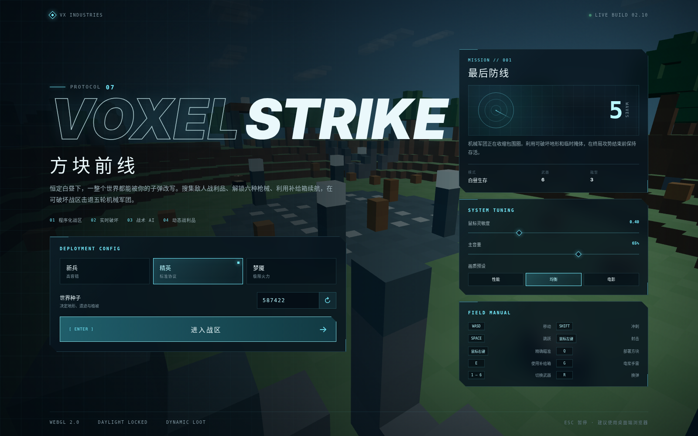
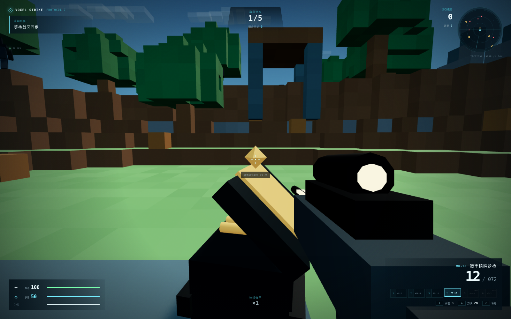

# VOXEL STRIKE // 方块前线 2.1

一款完全运行在浏览器里的 3D 体素 FPS。战区由代码实时生成，方块可以被子弹、霰弹与电浆手雷破坏，也能在交火中部署为临时掩体。模型、特效、界面与音效均为程序化生成，不依赖外部美术或音频资源。





## 2.1「白昼军械库」更新

- 移除昼夜循环与黑夜阶段，战局全程锁定在清晰、明亮的白昼。
- 默认鼠标灵敏度大幅降低，旧版设置会自动迁移到更合理的区间。
- 武器从 3 把扩展到 6 把，并加入第一人称换枪过渡、精确瞄准、独立后坐力与弹药状态。
- 敌人会掉落医疗包、弹药、护盾、建材、手雷和可解锁枪械；低血量与低弹药状态会触发保底机制。
- 地图加入 6 个可重复使用的弹药补给箱，靠近后按 `E` 使用，20 秒后重新充能。
- 新增 `V` 第三人称肩射视角，带可见角色模型与近墙相机收缩。
- 新增 `F` 战术冲刺，消耗体力进行短距离爆发机动。
- 出生区重做为开阔的缓坡战场，减少近场树木和随机高墙，改善第一轮的视野与走位。
- HUD 新增六槽军械栏、锁定状态、补给交互提示和更清楚的瞄准反馈。
- HUD 与雷达分频刷新，并为“均衡”画质加入自适应分辨率，在帧率不足时自动减轻 GPU 压力。

## 武器库

| 槽位 | 代号 | 武器 | 定位 |
| --- | --- | --- | --- |
| `1` | VX-7 | 脉冲步枪 | 稳定的全自动主武器 |
| `2` | VTR-9 | 疾风冲锋枪 | 高射速近距离压制 |
| `3` | SG-12 | 散射霰弹枪 | 近距离爆发与地形破坏 |
| `4` | MR-18 | 战术精射步枪 | 半自动、高精度中远程火力 |
| `5` | LM-60 | 堡垒轻机枪 | 大弹匣持续压制 |
| `6` | RG-3 | 磁轨步枪 | 高伤害终局武器 |

前三把武器开局可用；其余武器由敌人掉落。第 3 与第 9 次击杀会优先触发新武器掉落，连续未掉落时也有保底。

## 已实现系统

- 80 × 34 × 80 的种子化程序生成战区，包含开阔中央防线、山地、植被、遗迹、塔楼和战术设施。
- 分块体素网格与仅暴露面构建；地形变化只重建受影响区块。
- 第一人称移动、碰撞、台阶跨越、跳跃、冲刺、体力、镜头摇摆、精确瞄准和指针锁定。
- 第一/第三人称视角可在战斗中切换；第三人称使用程序化角色模型、肩射相机和地形防穿墙检测。
- 战术冲刺消耗体力并进入冷却，可用于横移、后撤或快速抢占掩体。
- 六把具有独立射速、弹匣、备用弹、扩散、射程、后坐力、装填时间、音效和程序化模型的枪械。
- 三种机械敌人：侦察兵、重装兵与哨戒机；具备视线判断、追击、绕障、射距选择和不同攻击节奏。
- 五轮生存任务、动态刷怪、波次奖励、连杀倍率、爆头、最高分与战后结算。
- 动态战利品循环：医疗包、弹药组件、护盾电池、纳米方块、手雷与武器模块。
- 六个地图补给箱、弹药保底、低血量医疗保底和武器掉落保底。
- 电浆手雷、爆炸地形破坏、金属方块建造、枪口闪光、弹壳、曳光弹、命中环和实例化碎块粒子。
- 恒定白昼天空、太阳漂移、云层、战术雷达与三档画质。
- Web Audio 合成枪声、爆炸、命中、换弹、脚步、受伤、拾取和波次提示音。
- 本地保存鼠标灵敏度、音量、画质、难度、世界种子与最高分。

## 直接试玩

最省事的方式是双击 `voxel-strike-standalone.html`。JavaScript、CSS 和图标都已内联，不需要安装或联网。

从源码启动：

```bash
npm install
npm run dev
```

生产构建与单文件打包：

```bash
npm run package
npm run preview
```

`npm run build` 只生成依赖 `dist/assets/` 的普通生产构建，`npm run package` 会先构建 `dist/`，再生成根目录的 `voxel-strike-standalone.html` 单文件版本。

## 操作

| 操作 | 按键 |
| --- | --- |
| 移动 | `W` `A` `S` `D` |
| 冲刺 | `Shift` |
| 战术冲刺 | `F` |
| 跳跃 | `Space` |
| 射击 | 鼠标左键 |
| 精确瞄准 | 鼠标右键 |
| 切换第一/第三人称视角 | `V` |
| 部署金属方块 | `Q` |
| 使用弹药补给箱 | `E` |
| 投掷电浆手雷 | `G` |
| 切换武器 | `1`—`6` 或滚轮 |
| 换弹 | `R` |
| 暂停/释放鼠标 | `Esc` |

## 代码结构

```text
src/
├── main.ts              菜单、HUD、设置、军械栏与应用入口
├── style.css            响应式战术 UI 与交互反馈
└── game/
    ├── game.ts           主循环、波次、掉落、补给箱、输入与玩法编排
    ├── world.ts          体素数据、地形生成、区块网格与 DDA 射线检测
    ├── player.ts         玩家运动、碰撞、生命、护盾与瞄准镜头
    ├── playerAvatar.ts   第三人称程序化角色模型与肩射枪械挂点
    ├── weapon.ts         六武器状态、换枪/装填动画与程序化模型
    ├── enemy.ts          敌人模型与战斗 AI
    ├── effects.ts        实例化粒子、曳光、冲击环与动态光
    ├── environment.ts    恒定白昼天空、太阳和云层
    ├── audio.ts          Web Audio 合成音效
    ├── noise.ts          可复现噪声与随机数
    └── types.ts          武器、敌人、方块、难度与设置配置
```

## 引擎取舍

当前版本继续使用 Three.js/WebGL 2，而不是迁移到 Babylon.js、PlayCanvas 或 Unity WebGL。原因是现有体素世界、离线单文件打包、程序化音画资源和原生 DOM HUD 都已经围绕 Three.js 深度集成；完整换引擎会带来大范围重写、包体增长和 `file://` 单文件交付风险。更合适的方向是先把相机、玩家、武器、敌人和掉落继续模块化，等出现物理、动画编辑器、关卡工作流等明确瓶颈时再评估引擎迁移。

## 技术栈

TypeScript、Three.js、WebGL 2、Web Audio API 与 Vite。推荐使用桌面版 Chromium、Chrome、Edge 或 Firefox，并开启浏览器硬件加速。
